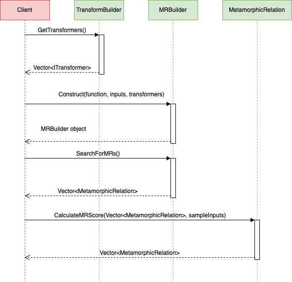

# Aya

Metamorphic Relation Search Tool

## What is Metamorphic Relation?

*Metamorphic Relation* is a relation between sequences (chains) of transformations performed on a given function (program) inputs, and matching transformations on the final result, or a part of the result.

*Consider function Sin(x).*

From trigonometry, we know that
```
Sin^2(x) = 1 - Cos^2(x)
```

This rule is valid for any x, no matter how transformed it is. Thus, this can be seen as a Metamorphic Relation between input *x* and the result of function *Sin^2(x)*.

### Benefits for Software Engineering

Valid Metamorphic Relations are useful as small specifications for our software, and are very friendly for later conversions into tests -- either unit if function being tested is a unit in itself, or even integration if function we're testing encompasses multiple components. Most importantly, such tests don't require a pre-calculated oracle, as they are oracles in themselves. For example, standard unit tests for *Sin^2(x)* would require us to get trusted implementation of *Sin^2(x)*, get outputs from it, and use them as oracles. With Metamorphic Relation testing, we'd simply verify if rule above is valid, alongside with very simple tests to check if Sine function works, e.g. checking if *Sin(90deg) == 1*.

## Why Aya?

Aya allows to operate on abstract functions of any signature, and transformers of various argument lists. It allows to transform and compare user-defined elements of produced states, allowing to cover data structures or algorithms outside of strictly mathematical libraries.

## Aya MR Generation Procedure

For usage examples, refer to Tests in `test/AyaSamples`. 

There are 4 components in Aya:

### ITransformer

Interface for a given input/output transformer. Encapsulates *std:function<void(T&, Args...)>* function pointer alongside with concrete Tuple of *Args...*. This is done to allow combining Transformers of any signature together.

### TransformBuilder

An Interface that allows to produce chains of *ITransformer* instances which accepts a collection of Transform functions and corresponding arguments to produce a pool of Transforms to be used in *MRBuilder*.

### MRBuilder

Component that Accepts Transformer Pools for inputs and outputs, tested function with sample inputs, and combines transforms into chains of specified length, verifying if any produced input and output Transformer Chains form a Metamorphic Relation.

### MetamorphicRelation

A structure with a form:

```
struct MetamorphicRelation
{
    std::vector<ITransformer> inputTransformerChain;
    std::vector<ITransformer> outputTransformerChain;
};
```

Also contains functions to validate the given MR against a different set of sample inputs.

### MR Generation Sequence

MR Generation consists of 3 synchronous calls to core components:



## How To Build & Run

```
cmake CMakeLists.txt
make
```

This will produce *AyaSamples* alongside with *libAya* dynamic library.

## Performed Tests

*Aya* was used to produce MRs for standard mathematical functions, provided by *cmath* library. Additionally, matrix-vector multiplication (BLAS) and text encoding (libiconv) was tested using Metamorphic Relation search.